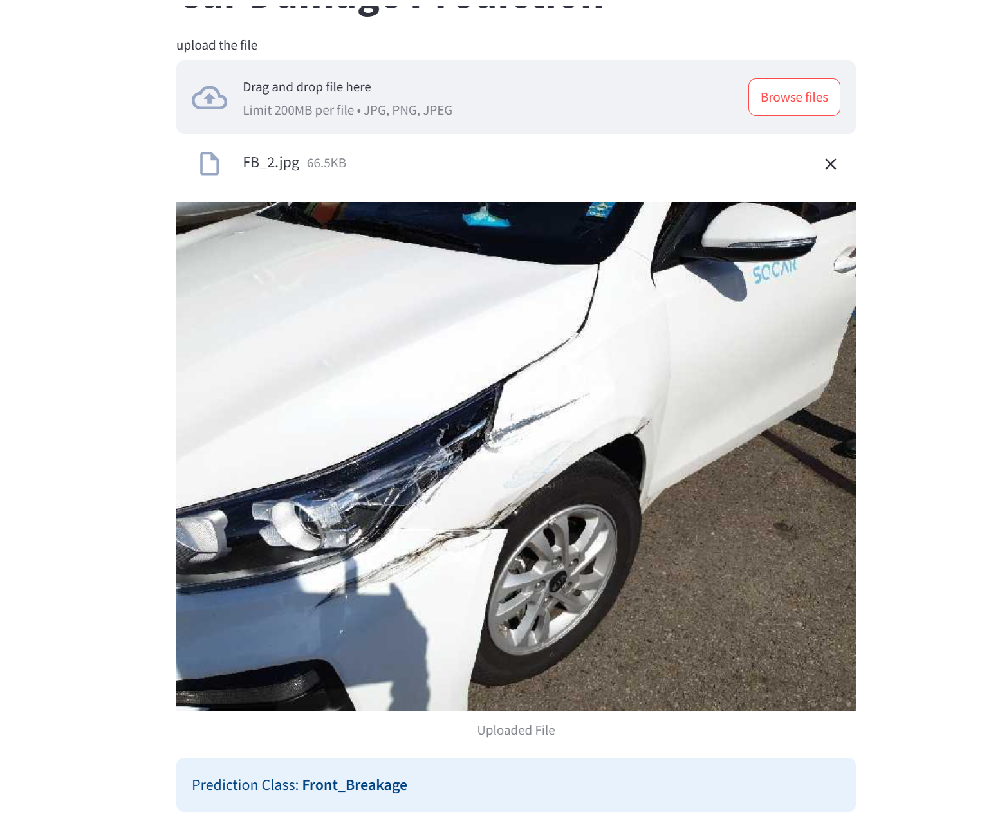

# Car Damage Prediction APP
A Streamlit web application that uses a deep learning model (ResNet50) to classify car damage from uploaded images.
Since the model is trained primarily on third-quarter front and rear views, it performs best when the uploaded images follow similar perspectives.
Uploading side views or close-up damage images may lead to less accurate predictions. For optimal results, use images showing the full front or rear at a slight angle.

## 📸 Demo




## 🔍 Features

- Upload car images (`.jpg`, `.png`)
- Classifies damage into:
  - Front_Breakage
  - Front_Crushed
  - Front_Normal
  - Rear_Breakage
  - Rear_Crushed
  - Rear_Normal
- Runs on CPU, no GPU required
- Clean and simple UI with Streamlit


## Set Up

1. To get started,first install the dependencies using:
  
```commandline
pip install -r requirements.txt
```
2. Run the app
```commandline
streamlit run app.py
